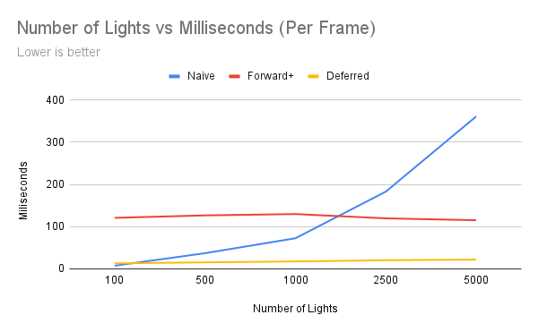
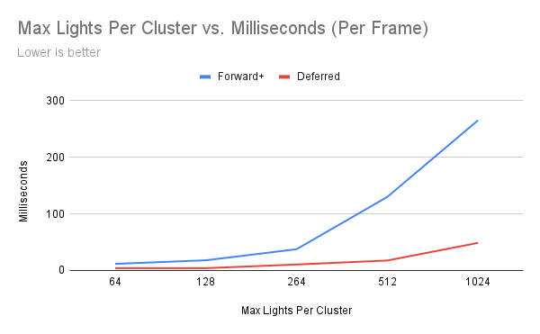

# WebGL Forward+ and Clustered Deferred Shading

**University of Pennsylvania, CIS 565: GPU Programming and Architecture, Project 4**

- Jacqueline Guan
  - [LinkedIn](https://www.linkedin.com/in/jackie-guan/)
  - [Personal website](https://jyguan18.github.io/)
- Tested on my personal laptop:
  - Windows 11 Pro 26100.4946
  - Processor AMD Ryzen 9 7945HX with Radeon Graphics
  - 32 GB RAM
  - Nvidia GeForce RTX 4080

### Live Demo

### Demo Video/GIF

## Introduction

In this project, I explored and learned WebGPU and implemented Forward+ and Clustered Deferred shading methods. The goal was to render the Sponza atrim model with a large number of dynamic point lights. A GUI is also included to toggle between the different rendering modes, set the number of lights in the scene, and analyze their performance.

## Implementation Details

### Part 1: Naive

In this approach, I had one render pass. For each object, the vertex shaader positioned the vertices in 3D space. In the fragment shader, for every pixel, I would get the pixel's position, normal, and color. Then I would look through every single light in the light set and calculate the lighting contribution from that light and add it to the accumulated total. After the loop finished, I combined the object's texture color to get the final pixel color.

In the naive approach, we are calculating lights that could be so far away from the pixel and have absolutely no effect on it. Therefore, runtime can become very very slow if there are a lot of lights and objects in the scene, since we check every single light.

### Part 2: Clustered Forward+ Rendering

In this approach, I added a pre-processing step to avoid the brute-force approach in naive. So instead of checking every single light, I would divide the camera's view into a 3D grid of "clusters". Then, I would figure out which light belongs to which cluster and each pixel would only have to check lights in its own cluster, which is a much smaller number compared to every single light in the scene.

So in this implementation, I have a compute pass and a geometry pass. In the compute pass, the shader divides the camera's view frustrum into a 3D grid of 16x9x24 clusters. For each cluster in the grid, I calculate a 3D bounding box, which then loops through all of the lights in the scene and checks if the light's sphere of influence intersects with that cluster's box. And finally it populates a ClusterSet buffer. For each buffer, it stores a list of indices pointing to the lights that affect it.

In the geometry pass, I find which cluster each pixel belongs to and instead of looping through all of the lights, I just look up the light list for that specific cluster.

This separates the lighting cost from the geometry. And so even with many lights, most clusters will only contain a small amount of them.

### Part 3: Clustered Deferred Rendering

In this approach, we have a compute pass, a g-buffer pass, and a lighting pass. The compute pass is pretty much identical to Forward+. In the g-buffer pass, I render all the scene geometry but I don't calculate any lighting. For each pixel, I store the albedos, positions, and normals into multiple screen-sized textures called the G-Buffer. In the lighting (fullscreen) pass, I draw one big triangle that covers the entire screen. A new, fullscreen fragment shader runs for every pixel on the screen exactly once. And for each pixel it, reads the g-buffer, finds its cluster, calculates lighting, and writes to the screen.

In the clustered deferred rendering, lighting calculation is only ever performed once per visible pixel. And so now the cost is purely dependent on screen resolution, not the geometric complexity of the scene. So, it is highly efficient and good for scenes with tons of objects and tons of lights.

## Performance Analysis
### Number of Lights

In the graph below, we can see the total number of active lights measured in milliseconds per frame (lower is better). This was measured at 512 max lights per cluster.

[]
- Naive Forward Rendering scales linearly with the number of lights, as would be expected. Each fragment loops through all lights in the scene, so as wthe number of lights increase, we can see a steep rise in render time.
- Forward+ Rendeirng remains pretty constant regardless of light count, but the baseline cost is pretty high since there is a per-tile light culling overhead.
- In Clustered Deferred Rendering, there is a slight increase with light count, but overall, it remains much faster than Forward+, which shows a good balance between setup and shading cost.

For large light count (e.g. 5000), Deferred is roughly 16x faster than Naive and 5x faster than Forward+.

### Max Lights Per Cluster

In the graph below, we can see the max number of lights per cluster measured in milliseconds per frame (lower is better). This was measured at 1000 lights in the scene.

[]
- Both renderers slwo down as the maximum number of lights per cluster increases.
- The Forward+ pipeline degrades much faster - cluster-light lists become large, consuming GPU bandwidth and shared memory.
- Deferred also slows down as cluster capacity increases but remains much stabler, since lighting is done after the G-Buffer construction and fewer fragments are shaded.

Optimal cluster sizes are between 64-128 lights per cluster. Larger clusters waste GPU time iterating through empty lists.

### Is one of them faster?
Yes, but it depends entirely on the scene. Clustered Deferred is significantly faster in scenes with high geometric complexity and a large number of lights. Forward+ can be faster in scenes with lower geometric complexity and fewer lights, where the overhead of the G-Buffer pass would outweight its benefits.

### Is one of them better at certain workloads?
Clsutered Deferred works really well in workloads that are geometrically dense, realistic environments with many dynamic lights and mostly opaque surfaces. Forward+ is better suited for scenes with less complex geometry but many light sources.

### Performance Differences - Causes
- Each frame launches a compute shader to assign lights to clusters. In WebGPU/WGSL, this involves two dispatches: one to calculate cluster AABBs and a second to perform light culling.
  - Forward+ suffers from overdraw. In a scene with a lot of overlapping objects, its single, complex fragment shader is executed for every single triangle fragment that passes the frustum test, even for fragments that will end up hidden behind others. This means that expensive lighitng calculations are performed multiple times for the same pixel, only to be thrown away.
  - Clustered Deeferred solves this by decoupling geometry from lighting. The G-Buffer pass is simple and fast, and while it does have an overdraw, it is only writing cheap data. The expensive lighting pass only happens once per pixel on the final, full screen surface. This is why the performance is pretty stable even when geometric complexity increases.
- Memory Bandwidth
  - Clustered deferred has major upfront cost, as for each frame, it writes multiple full-screen textures to GPU memory and then reads them all back in the lighting pass.
  - Forward+ has a lower baseline bandwidth but it increases as more lights affect a tile since the fragment shader must read from the large light-list buffers for every pixel. 

### Credits

- [Vite](https://vitejs.dev/)
- [loaders.gl](https://loaders.gl/)
- [dat.GUI](https://github.com/dataarts/dat.gui)
- [stats.js](https://github.com/mrdoob/stats.js)
- [wgpu-matrix](https://github.com/greggman/wgpu-matrix)
